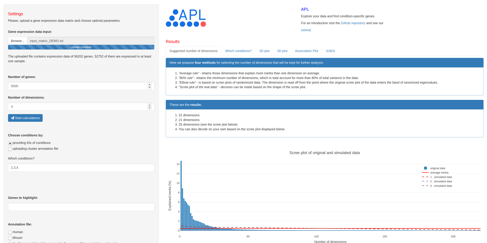

### Introduction

**APL** is an interactive application that can be used for finding condition-specific genes in complex data sets. After uploading the input matrix and choosing the parameters, the tool generates the 2D- and 3D-representation of the data, as well as the Association Plot for any selected condition or set of conditions. To identify the condition-specific genes one can zoom in the generated Association Plot and click the mouse over the genes presented in the plot. The tool allows also for enrichment analysis of the condition-specific genes based on the human or mouse gene ontology. 

Below we explain step-by-step how use the tool.

### Table of contents:


  1.  [Installation](#settingup)
  2.  [First steps](#settingup)
      + [Data upload](#sub-heading)
      + [Number of genes](#sub-heading)
      + [Number of dimensions](#sub-heading)
  3.  [2D- and 3D-representation of the data](#settingup)
      + [2D plot](#sub-heading)
      + [3D plot](#sub-heading)
  4.  [Association Plots](#settingup)
  5.  [Gene enrichment analysis](#settingup)
  6.  [Final remarks](#settingup)


### 1.  Installation

APL can be run directly from R. Before running the tool, make sure that following R packages are installed on your machine: `shiny`, `ggplot2`, `plotly`, `dplyr`, `shinycssloaders`. To launch APL we recommend to download all files from our GitHub repository and then run APL in R. To do this, first create a new directory `"APL"` on your machine and save all the files and directories from our GitHub repository in the newly created directory. Next, open an R session and set `"APL"` as your working directory. Now you can run the tool using following commands:
   
  ```R
      # load shiny library
      library(shiny)
      
      # run the tool from the working directory
      runApp("APL")
  ```
  
For further details please see the [documentation](https://github.com/elagralinska/associationplots/blob/master/README.md).

After launching the tool you will see the following window:


### 2.  First steps

#### Data upload
To demonstrate you how to use the tool, we applied it to an example data set, which is provided [here](https://github.com/elagralinska/APL/blob/master/TUTORIAL/input_matrix_DEMO.txt). The data constitutes a subset of GTEx data, containing gene expression values across multiple human tissues. The provided file contains in total information on 22 tissues, 10 samples per each. 

To analyze the data using our tool please save the file on your machine and then upload it in the application in the field `"Gene expression data input"`.


#### Number of genes
The factor, which greatly contributes to the computation time of APL, is the size of the input matrix. Reducing its size by discarding genes with the lowest variance across conditions (and, thus, the ones which are not likely to be highly condition-specific) would significantly shorten the computation time. 

In our program the user can choose the number of genes with the highest variance, which should be retained for further analysis. To do this, after uploading the input matrix a notification with two gene numbers will be displayed. The first value indicates the total number of genes, and the second one - number of genes with a non-zero variance. To choose the number of genes for further analysis, please use the field `"Number of genes"`. The selected number should be smaller or equal to the second displayed value. The default parameter is 1000.

For the analysis of our example data `5000` genes were chosen.

#### Number of dimensions
The step of reducing the size of the input matrix is followed by dimensionality reduction of the data. Reduced number of dimensions not only eliminates noise in the data but can also significantly shorten the computation time. To choose the number of dimensions, which will be further used for generating the Association Plots, please use the parameter `"Number of dimensions"`.

To give the user an impression on how many dimensions should be kept, four methods from the literature have been implemented in the program. The short description of the methods as well as the resulting numbers of dimensions are displayed in the tab `"Suggested number of dimensions"`. Below we explain each of them.




The implemented methods:
1.  *”Average rule“* - retains those dimensions that explain more inertia than one dimension on average. Such average value is calculated by dividing 100% by the total number of columns from the input matrix.
2.  *”80% rule“* - retains the minimum number of dimensions, which in total account for more than 80% of total variance in the data.
3.  *”Elbow rule“* - is based on scree plots of randomized data. The dimension is read off from the point where the actual
scree plot of the data enters the band of ranomized eigenvalues.
4.  *"Scree plot of the real data"* - decision can be made based on the shape of the scree plot by reading the number of dimensions corresponding to the jump in the plot.


In the example analysis presented in this tutorial the first three above listed methods gave following results: `31`, `21`, `25` dimensions. At the end `25` dimensions (number obtained using the "elbow rule") were chosen.
Now, to continue with the analysis, please click on a blue button `"Start calculations!"`.

### 3.  2D- and 3D-representation of the data
Based on the input matrix provided by the user APL generates 2D- and 3D- representation of the data. The generated plots are interactive and will be displayed in the tabs `"2D plot"` and `"3D plot"`. Below you can see the screenshot of a 2D plot generated for demo data.


As it was shown in the screenshot, below the 2D plot a barplot with expression values across all of the conditions for gene `GH2` is displayed. To generate such barplots, click a mouse over a gene (blue dot) in the 2D plot. 
One can also color the certain genes in all plots generated in APL (including 2D- and 3D-plots). To do this, please type the names of genes to color in the field `Genes to highlight`. (*Important: the gene names have to be in the same form as in the input matrix. When highlighting multiple genes, please use commas to separate the names, e.g. `KLF,GH2,LMN1`.*) The selected genes will be marked in red (example: gene GH2 in the screenshot above). 


### 4.  Association Plots
The next plot, which can by generated by APL, is the so-called Association Plot - a planar representation of gene-condition relationships in high-dimensional data. Association Plots are intended for finding and visualizing genes specific for a selected condition or a group of conditions from the input data. Hence, to generate such plot we have to first specify which conditions we would like to focus on. To do this, please use the column IDs that are indicated in the main panel in the tab `"Condition IDs"` and type them in the corresponding field located in the side panel (*Important: please use only comma-separated numbers, without spaces between them, e.g. `2,3,4`*). 

After finishing the calculations the Association Plot will be displayed in the tab `"Association plot"`. The interpretation of the Association Plot is simple: The farther out to the right a genes lies in the plot, the more associated it is to the given set of conditions. 

For the demonstration purposes the Association Plot in this tutorial was generated for liver samples (IDs: `212,213,214,215,216,217,218,219,220,221`) and can be seen below. Additionally, genes known from the literature to be highly expressed in liver we colored in red (by typing the gene names `F9,CFHR2,HPX,SPP2,MBL2,FGA,HAO1,APOH,F2,C9` in the field `Genes to highlight`). As expected, all of them are located in the right tail of the plot. To obtain the bar plot of gene expression values across all conditions, click a mouse over a given gene. The bar plot will show up below the Association Plot. 


Additionally, below the Association Plot a download button is located. Use it in order to download the list of the genes ranked according to their specificity for the given subset of conditions.

### 5.  Gene enrichment analysis
APL allows for enrichment analysis of the condition-specific genes. To conduct such analysis first make sure that in the field `"Which conditions?"` the correct condition IDs are chosen. Next, in the field `"Annotation file"` choose the correct gene ontology file (mouse or human) or provide your own file (look [here](https://github.com/elagralinska/APL/blob/master/TUTORIAL/annotation_file_FORMAT.txt) for the format of the input file). 
After choosing the correct parameters the results will be displayed in the tab `"GSEA plot"`, both in the tabular and the graphical form. The generated table will contain top ten gene categories enriched among condition-specific genes. The information on genes from each of these categories will be shown in the Association Plot above the table.

For the demonstration purpose, the enrichment analysis in this tutorial was conducted for liver samples (IDs: `212,213,214,215,216,217,218,219,220,221`) using the human gene ontology file. The obtained results are shown below.


### 6.  Final remarks
- To save the state of APL application and get a URL, which will restore the APL session with that state, please use the button `"Bookmarking..."` at the bottom of the side panel.
- The plots in APL are generated using the `plotly` package. To save a plot, use the camera icon in the modebar.


